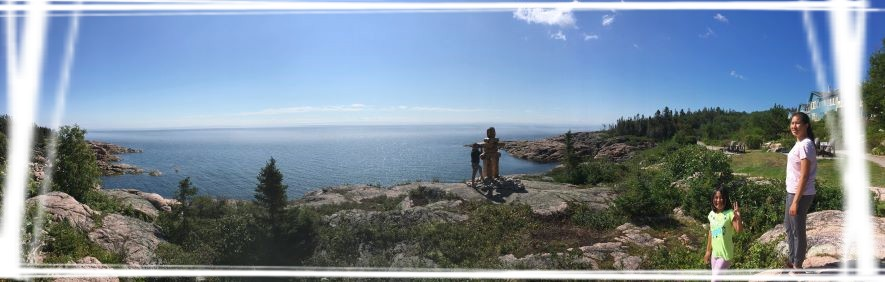

## 👋 Hi there, I am Chuong! A developer that build Full Stack applications 🚀 to solve business challenges 💼.

### I love travelling 🏖️ and learning new code. 📑

- 👀 I’m interested in...learning new stuff, one project at a time
- 🌱 I’m currently learning -- NEXTjs, TDD 🃏 (Test-Driven Development) and more...
- 💞️ I’m looking for collaborating on 'not so easy 🍦 nor too difficult 🦈 project'
- 📫 How to reach me: 'somewhere here, ..'

## **📖 Never stop learning 📚**

---

## 📈 GitHub Stats

<table>
  <tr>
    <td>:✨You are visitor</td>
    <td></td>
  </tr>
</table>

<!---
chuongtang/chuongtang is a ✨ special ✨ repository because its `README.md` (this file) appears on your GitHub profile.
You can click the Preview link to take a look at your changes.
--->
